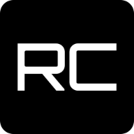

## Welcome to `Rigcoin`

Visit the live webapp at [Rigcoin.eth](https://rigcoin.eth)

*Please make sure your browser has Metamask installed. Tested on Brave, Chrome and Metamask-browser.*

---

This repo contains the official open sources for Rigcoin NFTs and the Rigcoin token. The webapp is permanently available using the IPFS hash `k51qzi5uqu5dienjx47dvf4yjyf39i6n51j7hy5uozdtid8of8hm5yl0wg3yqf`

---

##### Special thanks to people doing work at [Protocol Labs](https://protocol.ai/) on the following projects:
- [IPFS](https://ipfs.io/)
- [Filecoin](https://docs.filecoin.io/about-filecoin/ipfs-and-filecoin/)
- [NFT Storage](https://nft.storage/)

---

### Official Contract Addresses

*Never trust any other contracts claiming to be Rigcoin*

`Mainnet NFT Contract` [View on Etherscan](https://etherscan.io/address/0x0E68CeA2F61cC76F0f2676f99d4213A94714f74A) **source verified**
```
0x0E68CeA2F61cC76F0f2676f99d4213A94714f74A
```

`Mainnet Token Contract` [View on Etherscan](https://etherscan.io/address/0xa85DA5Dfc11BBA388B34aA0C3Cc278b0703050c1) **source verified**
```
0xa85DA5Dfc11BBA388B34aA0C3Cc278b0703050c1
```

*Rinkeby contracts are for testing purposes only*

`Rinkeby NFT Contract` [View on Etherscan](https://rinkeby.etherscan.io/address/0xfccC26fc4606a21BB92237A7D927114A3d172386)

```
0xfccC26fc4606a21BB92237A7D927114A3d172386
```

`Rinkeby Token Contract` [View on Etherscan](https://rinkeby.etherscan.io/address/0xbb0Cf91D71e742724b2725cf9Fa105C29E78C5Be) **source verified**
```
0xbb0Cf91D71e742724b2725cf9Fa105C29E78C5Be
```

---

### Image Proofs
There are 3 image sizes for each NFT, but only the 600x600 size is what
will show up inside Metamask and other platforms by default. Each NFT conforms to the
"ERC721 Metadata JSON Schema" [https://eips.ethereum.org/EIPS/eip-721](https://eips.ethereum.org/EIPS/eip-721), and each has
additional metadata outlined below - some of which is not currently supported, but
has been included for the future.


`600x600`
```
QmSqxUwSJEyBnos64HDWwuwoPn18E8aiHfDx4i2WXpWA9p/Rig{ID}.png
```

`1200x1200`
```
QmbDY9y7FpjnuYHfVbvCWELMzs8dyt6JahoNvWPPnjfS8g/Rig{ID}.png
```

`2400x2400`
```
Qmajo8sfjPXPbaCLCZhzzpqfgXi4N4FNQVpXYffMjD6VjV/Rig{ID}.png
```

---

### JSON objects

```
QmR6f6zhLNfsE6upkZkJCeuSSw2SJosy3Z6aJgAC5DQFfU/{ID}
```

```
BASE_JSON = {
  "name": BASE_NAME,
  "description": BASE_OBJ_DESC,            
  "image": BASE_IMAGE_URL,                    (600x600) IPFS
  "medium_image": BASE_MEDIUM_IMAGE_URL,    (1200x1200) IPFS
  "large_image": BASE_LARGE_IMAGE_URL,      (2400x2400) IPFS
  "external_url": BASE_SITE_URL,            (ENS domain)
  "attributes": [],
  "background_color": BASE_COLOR,
}
```

---

### Rigcoin Webapp

`QM hash`
```
QmRCu68Lem7mQDkwNUqdd9ZEgQhW7R45EKpMhnEW9M5SPY
```

`IPNS hash`
```
k51qzi5uqu5dienjx47dvf4yjyf39i6n51j7hy5uozdtid8of8hm5yl0wg3yqf
```
